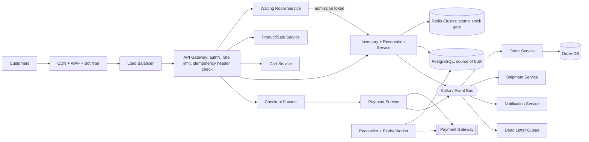
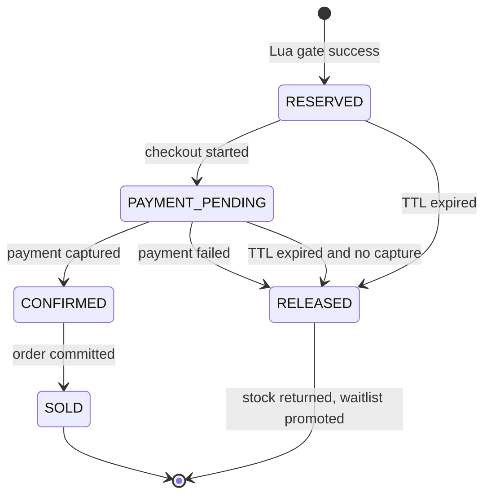
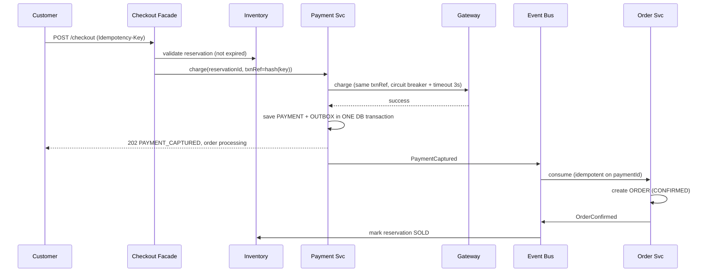
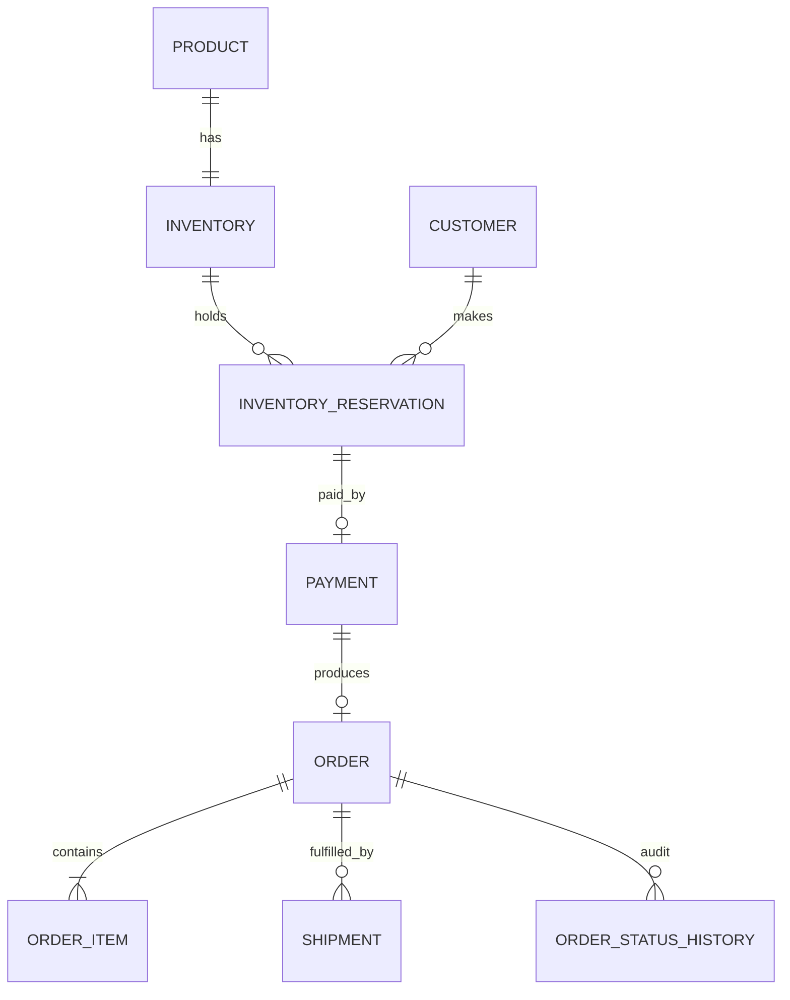
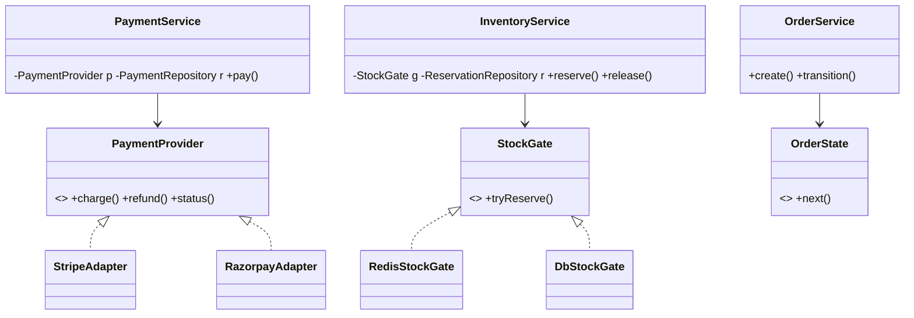

# SALESTORM: Flash-Sale Architecture Blueprint

**Core idea:** *Never let 10,000 users touch the database.* Absorb the crowd at the edge, admit only a controlled slice into checkout, decide stock in one atomic step, and let a durable event-driven saga finish the rest.

## 1. Requirements and Assumptions

| Type | Requirement | Guarantee or target |
| --- | --- | --- |
| Strict | Sold units never exceed 100 and stock is never negative | **Guarantee** |
| Strict | One idempotency key creates at most one reservation, payment and order | **Guarantee** |
| Strict | Paid customer always ends with an order or an automatic refund | **Guarantee** |
| Target | Buy-Now decision latency | p99 \< 200 ms |
| Target | Availability of browse and queue path | 99.99% |
| Target | Normal 10k RPS, flash peak 500k RPS (mostly reads and waiting-room polls) | Horizontal scale |
| Target | Reservation TTL 5 min; recovery RTO \< 60 s, RPO = 0 for paid orders | Target |

**Assumptions:** 1 hot SKU, payment gateway p95 about 2 s, gateway supports idempotency keys, customers are authenticated before the sale starts.

## 2. HLD and Container Architecture



**Why each component exists**

- **CDN/WAF:** serves product pages statically (kills about 90% of read load), blocks bots.
- **Waiting Room (creative part):** a virtual queue issues signed, short-lived *admission tokens* at a fixed rate (for example 3x the stock). The rest see "You are #4,210 in line", so the system load is bounded no matter how big the crowd is.
- **Redis:** single-threaded atomic Lua script for the stock gate. Fast and deterministic.
- **PostgreSQL:** durable truth, with a `CHECK (available_quantity >= 0)` backstop.
- **Kafka + outbox:** decouples payment, order, shipment and notification, so one slow service cannot stall checkout.

**Sync vs async:** Buy Now, reserve and pay-initiate are **sync** (the user needs an answer). Order creation, shipment and notification are **async** (eventual, retryable).

## 3. Inventory Reservation: Where Consistency Is Guaranteed

**The exact contention point** is one Lua script executed atomically on the Redis shard owning `stock:{productX}`:

```lua
-- KEYS: stock, idem:{key}, resv:{id}   ARGV: user, ttl, key
if redis.call('EXISTS', KEYS[2]) == 1 then return redis.call('GET', KEYS[2]) end  -- duplicate: same answer
if tonumber(redis.call('GET', KEYS[1])) <= 0 then return 'SOLD_OUT' end
redis.call('DECR', KEYS[1])
redis.call('SET', KEYS[2], ARGV[4], 'EX', ARGV[2])   -- idempotency -> reservation id
redis.call('SET', KEYS[3], ARGV[1], 'EX', ARGV[2])   -- reservation with TTL
return 'RESERVED'
```

Two requests for the last unit hit the same script. Redis runs them one after the other, so exactly one gets `RESERVED` and the other gets `SOLD_OUT`. The reservation is then persisted to Postgres through the outbox, using a conditional update: `UPDATE inventory SET available_quantity = available_quantity-1, reserved_quantity = reserved_quantity+1, version=version+1 WHERE product_id=? AND available_quantity>=1`

| Approach | Pros | Cons | Verdict |
| --- | --- | --- | --- |
| Pessimistic (`SELECT FOR UPDATE`) | Simple, correct | 10k requests queue on one row, connection exhaustion | Fallback only |
| Optimistic (version check) | No locks | Retry storm: about 9,900 conflicts on a hot row | Rejected for hot SKU |
| **Redis atomic gate + DB conditional update** | Microsecond decision, bounded DB load | Redis is a second system, needs failover handling | **Selected** |

**Redis failure:** replicas with AOF. If Redis is lost, the system falls back to the DB conditional-update path behind a strict rate limiter, and the Redis counter is rebuilt from `available_quantity` in the DB. The DB `CHECK` makes overselling impossible even if Redis is wrong.

**Scale-out for many hot SKUs:** shard by `product_id`. For one super-hot SKU, split stock into N buckets (for example 4 x 25) with random pick and steal-on-empty.

### Reservation State Diagram



**Creative touch, waitlist promotion:** the 5% failed payments (about 5 units) and expired holds are not wasted. Released units are offered in order to the *waitlist* of users who got `SOLD_OUT`, with a fresh 3-minute hold.

## 4. Payment and Order Workflow



| Scenario | Design response |
| --- | --- |
| Payment fails (5%) | `PaymentFailed` event, reservation RELEASED, waitlist promoted, order marked FAILED |
| Gateway timeout | Mark payment `UNKNOWN`, **never blind-retry a new charge**. Retry with the *same* txnRef or query gateway status; reconciler resolves it |
| Duplicate payment | Unique constraint on `idempotency_key` and `txn_ref`; second call returns the stored result |
| Gateway down | Circuit breaker opens, user sees "payment temporarily unavailable"; reservation TTL is extended once (max 1x) so the user does not lose the unit |
| **Payment OK, Order Service down 30 s** | Money is safe because `PaymentCaptured` sits durably in Kafka. Order Service retries with exponential backoff, then DLQ after N tries. On recovery it consumes the backlog. Order creation is idempotent on `paymentId`. The user sees "Payment received, order confirming". If not fixed within SLA, the reconciler **refunds automatically** (compensation) |

**Order states:** `CREATED → PAYMENT_PENDING → CONFIRMED → PROCESSING → SHIPPED → OUT_FOR_DELIVERY → DELIVERED`, with `CANCELLED` allowed from CREATED, PAYMENT_PENDING, CONFIRMED and PROCESSING, and `REFUNDED` after cancel of a paid order. No transitions backwards, and each is logged in `ORDER_STATUS_HISTORY`.

**Pattern: Saga (choreography) + Transactional Outbox** gives atomic "state change + event" without distributed transactions.

## 5. Database (key tables)



- `INVENTORY(inventory_id PK, product_id FK UNIQUE, available_quantity, reserved_quantity, sold_quantity, version, updated_at)` with `CHECK(available>=0 AND available+reserved+sold = total)`.
- `INVENTORY_RESERVATION(reservation_id PK, inventory_id FK, customer_id FK, status, expires_at, idempotency_key UNIQUE)`, indexed on `(status, expires_at)` for the expiry worker.
- `PAYMENT(payment_id PK, reservation_id FK UNIQUE, txn_ref UNIQUE, status, amount)`.
- `ORDER(order_id PK, payment_id FK UNIQUE, status, ...)`. The unique payment link prevents duplicate orders.
- `OUTBOX(id, aggregate, event_type, payload, published)` and `PROCESSED_EVENTS(event_id PK)` for consumer dedupe.
- **SQL over NoSQL:** money and stock need ACID, constraints and joins. NoSQL is used only for the cache and event log.

## 6. API Summary

| Method + endpoint | Purpose | Notes |
| --- | --- | --- |
| `POST /v1/sales/{id}/queue` | Join waiting room | returns position + poll URL |
| `POST /v1/reservations` | Buy Now | JWT + admission token + `Idempotency-Key`; `201` reserved, `409 SOLD_OUT`, `429` throttled |
| `POST /v1/checkout` | Start payment | `202` accepted, `410` reservation expired |
| `GET /v1/orders/{id}` | Status |  |
| `POST /v1/orders/{id}/cancel` | Cancel | state-machine guarded |

**Events (owner):** `StockReserved` and `ReservationReleased` (Inventory), `PaymentCaptured` and `PaymentFailed` (Payment), `OrderConfirmed` (Order), `ShipmentCreated` (Shipment). Errors use a uniform `{code, message, traceId}`.

## 7. LLD, SOLID and Patterns



| Pattern | Where | Trade-off |
| --- | --- | --- |
| Strategy | `StockGate` (Redis or DB), pricing | more classes |
| Adapter + Factory | Payment providers | needs per-provider mapping |
| State | Order and reservation lifecycle | many small classes |
| Observer / events | Notification, shipment | harder to trace, so we add tracing |
| Circuit Breaker | Gateway calls | can reject valid requests briefly |
| Facade | Checkout orchestration | can grow, so keep it thin |
| Repository | Persistence | extra layer |

**SOLID:** SRP (Payment, Order and Notification are separate), OCP (new provider = new Adapter only), LSP (Redis and DB gates both honour the `tryReserve` contract), ISP (separate `Charger`, `Refunder`, `StatusChecker`), DIP (services depend on interfaces, wired by DI).

## 8. Scalability, Reliability, Security, Observability

**50x traffic:** the waiting room and CDN absorb the surge (static queue page, edge-computed tokens). The admitted rate stays constant, so the core system sees almost the same load. Autoscale the stateless gateway and services, add Redis shards, and use Kafka partitions keyed by `product_id` or `order_id`. **Likely bottleneck:** the hot-SKU Redis shard (mitigated by sharding) and then the payment gateway (mitigated by admission control).

**Failure recovery:** DB primary down → synchronous replica promoted (RPO 0 for payments), writes retry via outbox. Gateway down → circuit breaker + extended hold + reconciler. Consumer crash → at-least-once delivery + idempotent consumers + DLQ with replay tooling. Expiry worker restarts safely because `status` transitions are conditional updates.

**Security:** OAuth2/JWT, TLS everywhere, WAF + per-user and per-IP rate limits, bot challenge before queue entry, input validation, tokenized payments (no card data stored, PCI scope pushed to the gateway), secrets in a vault, immutable audit log.

**Observability:** metrics for request rate, p99 latency, error rate, reservation success/fail, payment failure %, order conversion, queue lag. Structured JSON logs carrying `traceId`, `reservationId`, `paymentId`, `orderId`. OpenTelemetry tracing across checkout → payment → order. **Alerts:** `sold + reserved + available != total`, payment failure above 10%, Kafka lag above 30 s, DLQ not empty, reservations stuck over TTL.

## 9. ADR (short)

| # | Decision | Alternatives | Why / cost |
| --- | --- | --- | --- |
| 1 | Redis atomic gate + DB constraint | Row lock, optimistic | Fast and bounded; cost: two stores to keep in sync |
| 2 | Waiting room + admission tokens | Raw rate limit | Fair, protects downstream; cost: slight UX delay |
| 3 | Async order creation via outbox and Kafka | Sync call | Survives Order outage; cost: eventual consistency |
| 4 | PostgreSQL | NoSQL | ACID for money/stock; cost: scale via sharding and replicas |
| 5 | Choreographed saga | 2PC | No global locks; cost: needs reconciler |
| 6 | Cache-aside for catalog, no cache for stock truth | Cache everything | Prevents stale stock decisions |

**Sacrifices:** strong consistency on order visibility (eventual, seconds), simplicity (more moving parts), and some users wait in a queue to protect everyone's correctness.

## 10. The 5-Minute Pitch Answer (final jury question)

1. 10,000 users hit the CDN; sale page is static; the waiting room assigns positions.
2. Admission tokens release about 300 users at a time; the rest wait fairly.
3. Each Buy Now runs the Lua script atomically: the first 100 get `RESERVED`, the rest get `SOLD_OUT` in under 200 ms and join the waitlist. Duplicates (2%) return the same reservation.
4. Reserved users pay within 5 minutes. About 95 succeed → `PaymentCaptured` through the outbox → order created idempotently. About 5 fail or expire → units released → waitlist promoted.
5. If Order Service is down 30 s, events wait in Kafka, then drain; the reconciler refunds anything unresolved.
6. End state: exactly 100 orders (never more), 0 duplicate charges, full audit trail.

## 11. AI-Use Note (template)

Tool: Claude, used for drafting the blueprint outline and diagram text. Team reviewed, corrected and can defend every decision. Suggested validation: a small Python or Locust simulation of 10,000 threads against the Lua script (expect exactly 100 `RESERVED`).